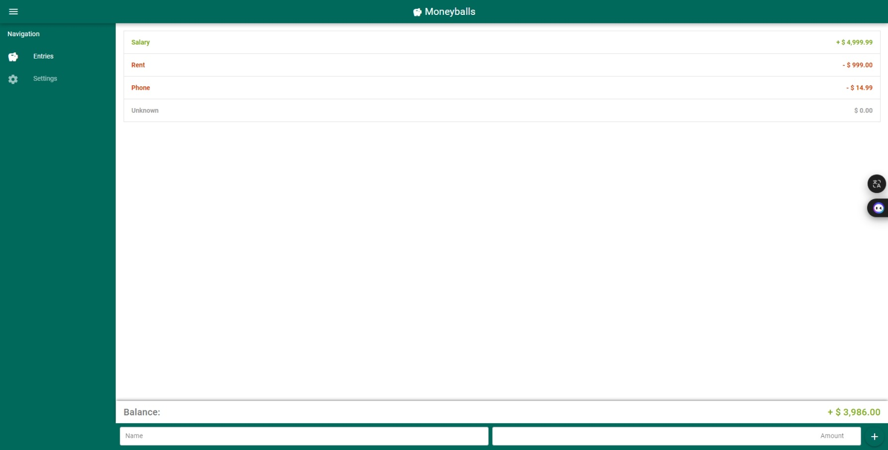

# 記帳APP

學習 Vue3 & Quasar2 後的第一個練習專案，主用來熟悉操作Quasar工具及其他相關設定

# Moneyballs (quasar-moneyballs)

A Quasar Project

# 專案中所使用的 Git commit 範例參考來源
[點我看更多commit範例](https://wadehuanglearning.blogspot.com/2019/05/commit-commit-commit-why-what-commit.html)

# 專案經開啟 Live Server 後瀏覽器畫面與對應檔案名稱如下
Moneyball_畫面1.jpeg

